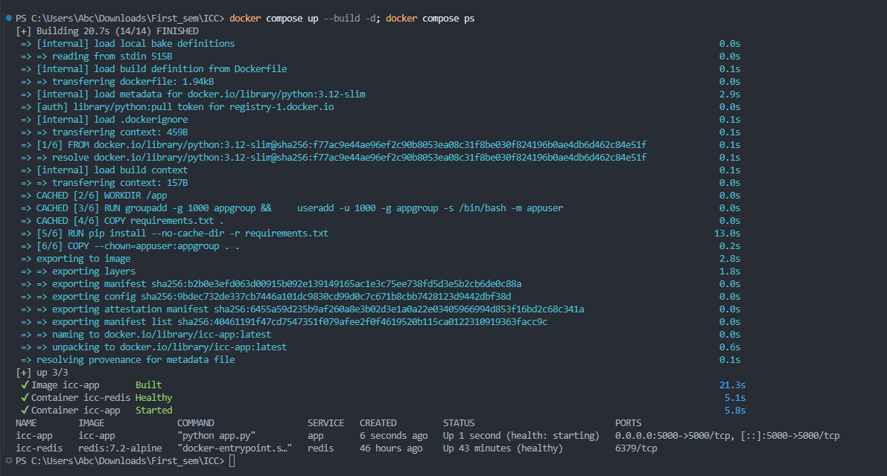
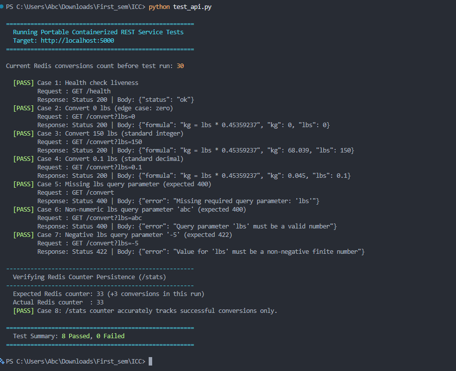
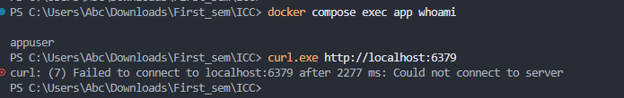
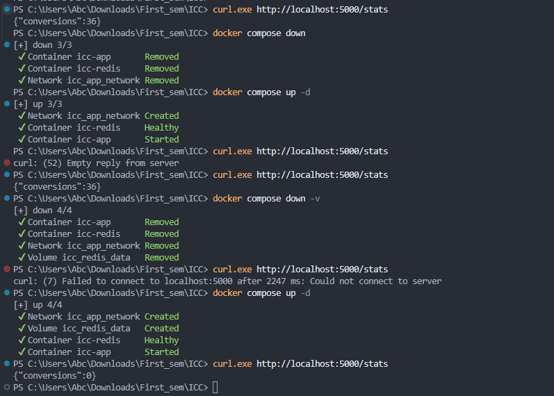

# Project 1 — Portable Containerized REST Service

**Course:** CS 554 — Introduction to Cloud Computing  
**Author:** Graduate Student Submission  

---

## 1. Prerequisites

Before running the service, ensure the following are installed:
- **Docker Desktop** (version 24.0+ with Compose v2.20+) and WSL 2 backend enabled (on Windows).
- **Python 3.10+** (standard library only; used to run the automated test suite `test_api.py`).
- **curl** or **PowerShell** (for manual HTTP endpoint testing).

---

## 2. How to Build and Start the Complete Application

To build the application image and start both the application and Redis services in the background, run:

```bash
docker compose up --build -d
```

### Flags Explained:
- `--build`: Forces Docker Compose to build the application container image using the local `Dockerfile`.
- `-d`: Detached mode, running the containers in the background and returning terminal control.

To verify that both containers are running and healthy:

```bash
docker compose ps
```

Expected output shows both `icc-app` and `icc-redis` in an `Up (healthy)` state.

---

## 3. How to Test Each Endpoint

The service listens on host port `5000` (`http://localhost:5000`).

### 3.1 Automated Test Suite
An automated test script is provided that validates all 8 required rubric test cases (including boundary, negative, and invalid input conditions, and verifying persistent counting in Redis):

```bash
python test_api.py
```

*(Alternatively, on Windows PowerShell: `.\test_api.ps1`)*

### 3.2 Manual curl Commands

#### 1. Application Liveness Check
```bash
curl -i http://localhost:5000/health
```
**Expected Response (200 OK):**
```json
{
  "status": "ok"
}
```

#### 2. Standard Conversion (`lbs=150`)
```bash
curl -i "http://localhost:5000/convert?lbs=150"
```
**Expected Response (200 OK):**
```json
{
  "formula": "kg = lbs * 0.45359237",
  "kg": 68.039,
  "lbs": 150
}
```

#### 3. Boundary Case: Zero (`lbs=0`)
```bash
curl -i "http://localhost:5000/convert?lbs=0"
```
**Expected Response (200 OK):**
```json
{
  "formula": "kg = lbs * 0.45359237",
  "kg": 0,
  "lbs": 0
}
```

#### 4. Decimal Value (`lbs=0.1`)
```bash
curl -i "http://localhost:5000/convert?lbs=0.1"
```
**Expected Response (200 OK):**
```json
{
  "formula": "kg = lbs * 0.45359237",
  "kg": 0.045,
  "lbs": 0.1
}
```

#### 5. Error: Missing Parameter (400 Bad Request)
```bash
curl -i http://localhost:5000/convert
```
**Expected Response (400 Bad Request):**
```json
{
  "error": "Missing required query parameter: 'lbs'"
}
```

#### 6. Error: Non-Numeric Parameter (400 Bad Request)
```bash
curl -i "http://localhost:5000/convert?lbs=abc"
```
**Expected Response (400 Bad Request):**
```json
{
  "error": "Query parameter 'lbs' must be a valid number"
}
```

#### 7. Error: Negative Value (422 Unprocessable Entity)
```bash
curl -i "http://localhost:5000/convert?lbs=-5"
```
**Expected Response (422 Unprocessable Entity):**
```json
{
  "error": "Value for 'lbs' must be a non-negative finite number"
}
```

#### 8. Retrieve Cumulative Successful Conversions
```bash
curl -i http://localhost:5000/stats
```
**Expected Response (200 OK):**
```json
{
  "conversions": 3
}
```
*(Note: Only valid conversion requests increment this counter. Invalid requests do not increment it).*

---

## 4. How to View Logs and Inspect Running Services

### View Logs
View real-time logs for all services:
```bash
docker compose logs -f
```

View application logs only:
```bash
docker compose logs -f app
```

View Redis logs only:
```bash
docker compose logs -f redis
```

### Inspect Container Security
Verify the application process runs as the unprivileged user `appuser` (UID 1000):
```bash
docker compose exec app whoami
```
**Output:** `appuser`

Verify that Redis port 6379 is not exposed to the host:
```bash
curl http://localhost:6379
```
**Output:** Fails with connection refused.

---

## 5. How to Stop and Clean Up the Application

### Temporary Stop
Pauses running containers without removing them:
```bash
docker compose stop
```

### Container Teardown (Preserving Persistent Volume)
Stops and deletes container instances and the network, but **retains** the named volume (`redis_data`) on disk:
```bash
docker compose down
```

### Verify State Persistence
After running `docker compose down`, restart the environment:
```bash
docker compose up -d
curl http://localhost:5000/stats
```
The counter reports the exact previous count, demonstrating that state survived container destruction.

### Full Teardown and Cleanup
Stops containers, deletes the private network, and **permanently removes** the named volume:
```bash
docker compose down -v
```

---

## 6. Operational Demonstration Evidence

The operational requirements from the assignment specification were tested and verified:

### 1. Build and Start (`docker compose up --build -d; docker compose ps`)


### 2. Automated Test Suite Execution (`python test_api.py`)


### 3. Manual Endpoint Testing & Service Logs


### 4. Security Verification (Non-Root User & Port 6379 Isolation)


### 5. Volume Persistence & Teardown (`docker compose down` vs `down -v`)


---

## 7. Design Decisions

### How the Application Locates Redis
The application resolves Redis dynamically through Docker's internal DNS service discovery rather than a hardcoded IP address. In `compose.yaml`, the Redis service is defined with the service name `redis`. The application container is configured with the runtime environment variable:
```bash
REDIS_HOST=redis
```
When `redis_client` initializes in `app.py`, Docker's embedded DNS server (at `127.0.0.11`) automatically resolves the hostname `redis` to the internal IP address assigned to `icc-redis` on `app_network`.

### Why Redis is Not Exposed to the Host
Redis is an internal database intended strictly for the application service. Publishing port `6379` to the host:
1. Violates the **Principle of Least Privilege** by unnecessarily opening a database port to host processes and external networks.
2. Increases the attack surface. Keeping Redis isolated within `app_network` ensures only containers explicitly attached to that private bridge network can communicate with it.

### Why the Redis Volume is Separate from the Redis Container
Containers are designed to be ephemeral and disposable. If database state were stored in the writable container layer, running `docker compose down` or upgrading the Redis image would destroy all stored conversion history. 

By mounting a named volume (`redis_data`) to `/data` and configuring Redis with `--appendonly yes`:
- Database writes bypass the container storage layer and persist directly on the host filesystem.
- Application state survives container deletion, stopping, and recreation.

### Comparison: Containerized Design vs. Direct Installation on a Virtual Machine (VM)
- **One Benefit:** **Portability and Reproducibility.** The entire environment (exact Python version, Redis server, dependencies, network topology, and configurations) is declared as code. A developer or grader can clone the repository and run `docker compose up` with guaranteed identical behavior on Windows, macOS, or Linux without configuration drift.
- **One Limitation:** **Shared Kernel Isolation.** Containers share the underlying host operating system kernel. A security vulnerability at the kernel level can potentially impact all containers on the host, whereas a VM provides hardware-level virtualization through a hypervisor with dedicated kernels per machine.

---

## 8. Graduate Extension (CS 554)

### 8.1 Service Restart Policy Configuration
Both services configure:
```yaml
restart: unless-stopped
```
- **When it applies:** If a container process exits unexpectedly (e.g., memory exhaustion or uncaught runtime panic), the Docker daemon automatically restarts the container. If the host machine or Docker daemon reboots, containers marked `unless-stopped` automatically restart upon daemon boot.
- **When it does not apply:** If an operator explicitly stops the containers via `docker compose stop` or `docker compose down`, Docker marks them as intentionally halted and does not attempt to restart them.

### 8.2 Failure Scenario Analysis: Application / Redis Dependency
**Scenario:** The Redis container stops unexpectedly or becomes temporarily unreachable while the application continues running.

- **System Behavior:**
  1. **Application Process Resiliency:** In `app.py`, Redis operations are wrapped in `try/except` blocks catching `redis.exceptions.RedisError`, with a connection timeout set to `2.0s`. The Flask application process does not crash or ungracefully terminate.
  2. **Endpoint Behavior:**
     - `/health` continues to return HTTP `200 OK` (`{"status": "ok"}`), allowing container orchestrators to identify that the web service itself is alive.
     - `/convert` and `/stats` catch the `RedisError` and immediately return HTTP `503 Service Unavailable` with a structured JSON error response (`{"error": "Redis service unavailable"}`), preventing unhandled 500 internal server errors.
  3. **Automatic Recovery:** Once the Redis container restarts or network connectivity recovers, subsequent `/convert` and `/stats` requests automatically resume succeeding without requiring the application container to restart.

### 8.3 Detailed Comparison: Compose Architecture vs. Single Virtual Machine (VM)

| Dimension | Docker Compose Architecture | Single Virtual Machine (VM) Architecture |
| :--- | :--- | :--- |
| **Resource Overhead** | Containers share the host OS kernel and isolate processes via namespaces and cgroups. CPU and memory overhead is minimal (~15MB per container). | A VM requires a full guest operating system, virtualized hardware drivers, and dedicated RAM/disk allocation (gigabytes of overhead). |
| **Startup & Provisioning** | Startup is near-instantaneous (sub-second process spawn). Environment is fully declared in `compose.yaml` with zero drift. | VM boot times take tens of seconds to minutes. Provisioning requires shell scripts or configuration management tools (Ansible/Puppet) prone to environment drift. |
| **Network Security** | Bridge network namespaces isolate Redis internally without requiring host firewall rules. | Both services share the same local network interface (`localhost`). Restricting Redis access requires host firewall configuration (`ufw`/`iptables`) or binding strictly to `127.0.0.1`. |

#### Two Key Architectural Tradeoffs:
1. **Tradeoff 1: Kernel Isolation vs. Execution Performance:** Virtual machines use hypervisor-level hardware virtualization, providing a hard security boundary between workloads. Containers share the host kernel, which has a slightly larger kernel attack surface, but eliminates the virtualization performance penalty, yielding bare-metal CPU and I/O speeds.
2. **Tradeoff 2: Orchestration Simplicity vs. Multi-Host Scalability:** Docker Compose provides simple, declarative single-host orchestration that is ideal for development and reproducible testing. However, it cannot schedule containers across multiple physical machines. Scaling horizontally across a server cluster requires moving to a distributed orchestrator like Kubernetes.

